# create_weekly_report.py 프로세스 다이어그램

## 📋 전체 프로세스 플로우

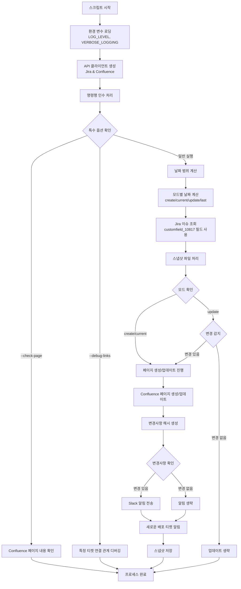

## 📅 날짜 계산 프로세스

```mermaid
flowchart TD
    A[날짜 계산 시작] --> B[현재 날짜 확인]
    B --> C{모드 확인}
    
    C -->|create| D[다음 주 계산<br/>today + (7 - weekday)]
    C -->|current| E[이번 주 계산<br/>today - weekday]
    C -->|update| F[이번 주 계산<br/>today - weekday]
    C -->|last| G[지난 주 계산<br/>today - weekday - 7]
    
    D --> H[월요일 ~ 일요일 범위 설정]
    E --> H
    F --> H
    G --> H
    
    H --> I[페이지 제목 생성<br/>X월 Y째주 형식]
    I --> J[날짜 계산 완료]
```

## 🔍 Jira 이슈 조회 프로세스

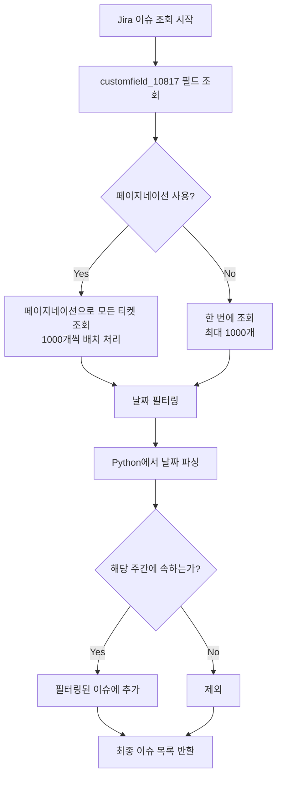

## 📄 Confluence 페이지 생성/업데이트 프로세스

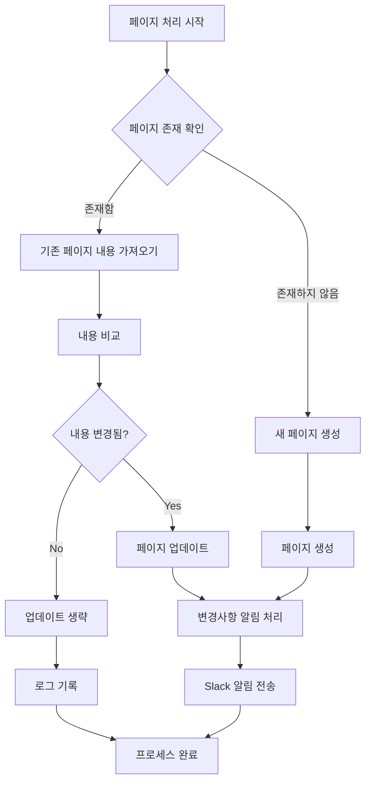

## 📢 Slack 알림 프로세스

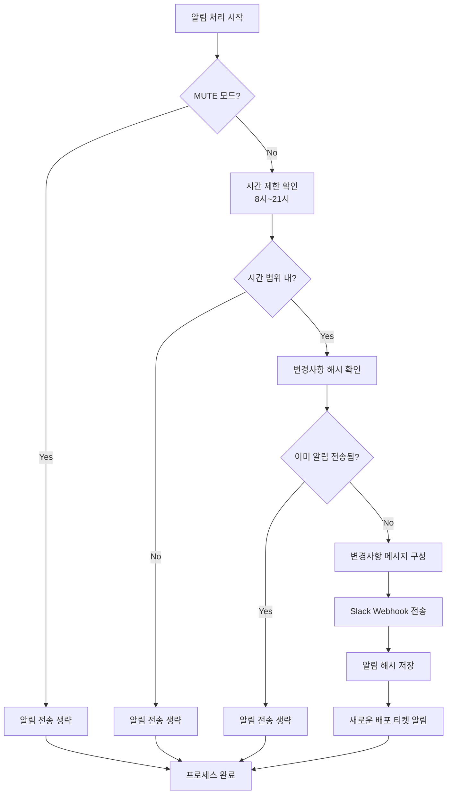

## 🔗 배포 티켓 연결 관계 조회 프로세스

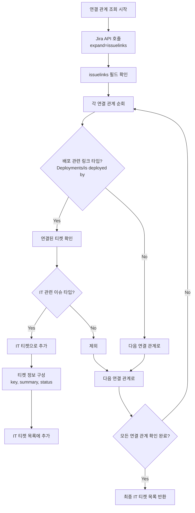

## 📸 스냅샷 관리 프로세스

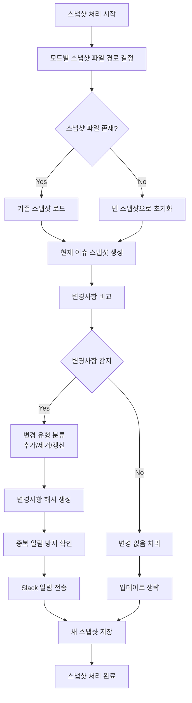

## 📝 로그 시스템 프로세스

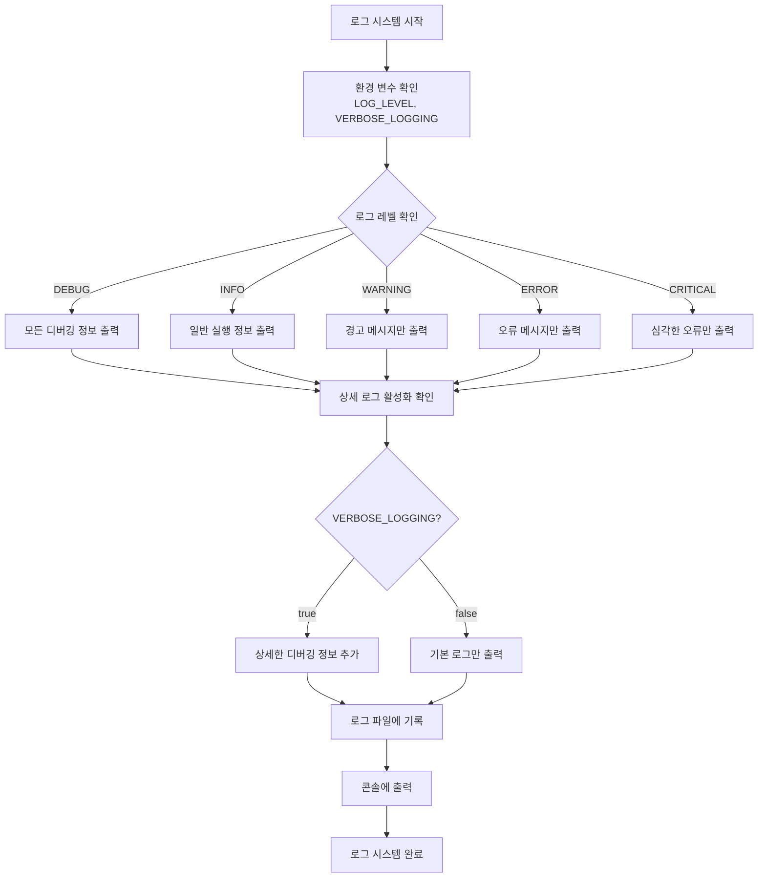

## 🤖 TaskMaster AI 통합 프로세스

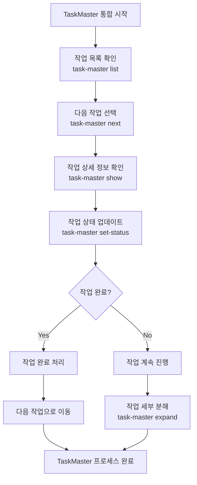

## 🔧 주요 함수별 역할

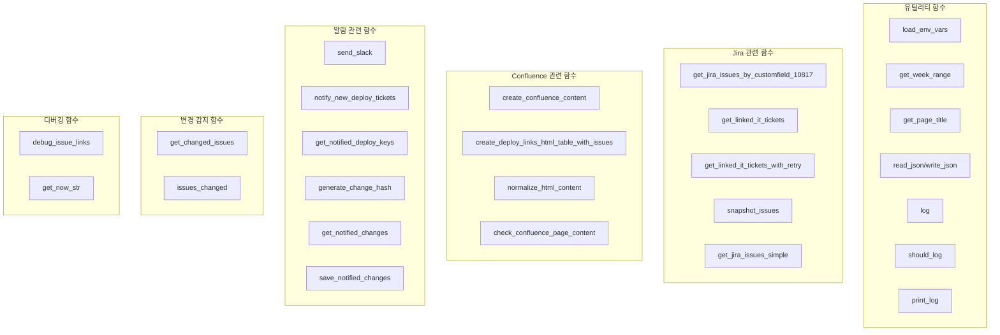

## ⚙️ 환경 변수 및 설정

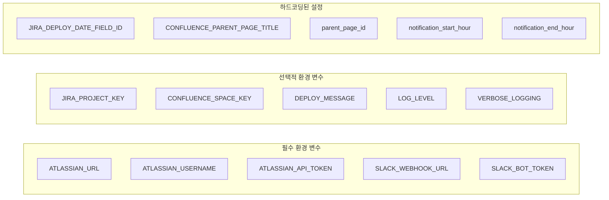

## 🎯 실행 모드별 동작

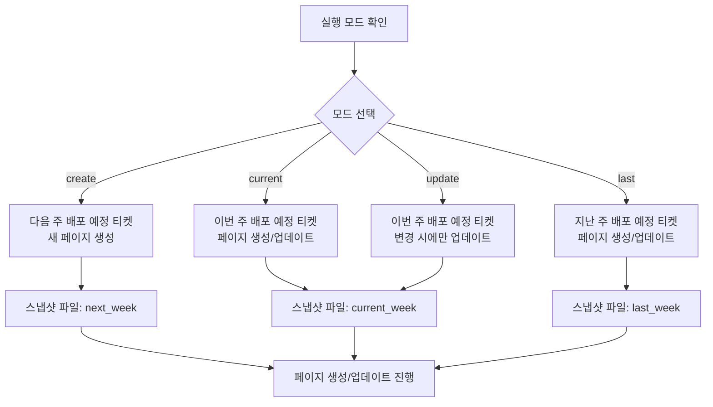

## 📊 코드 최적화 결과

### 최적화 전후 비교

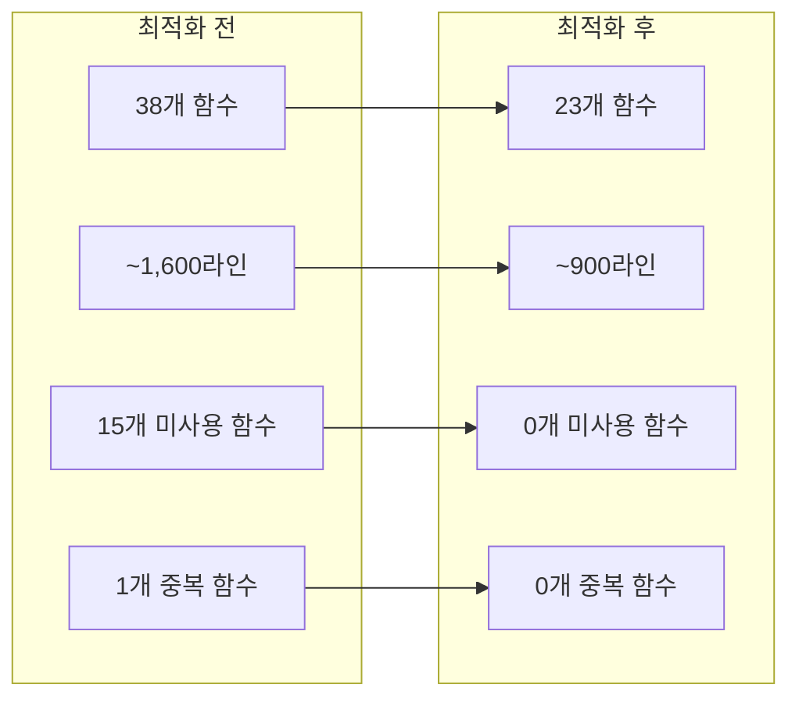

### 제거된 함수 분류

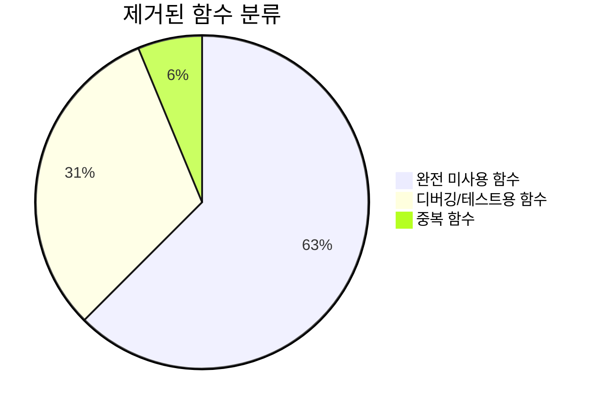

## 🔄 성능 최적화 프로세스

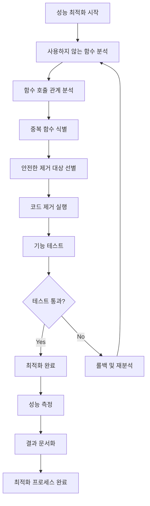

## 📈 모니터링 및 로그 시스템

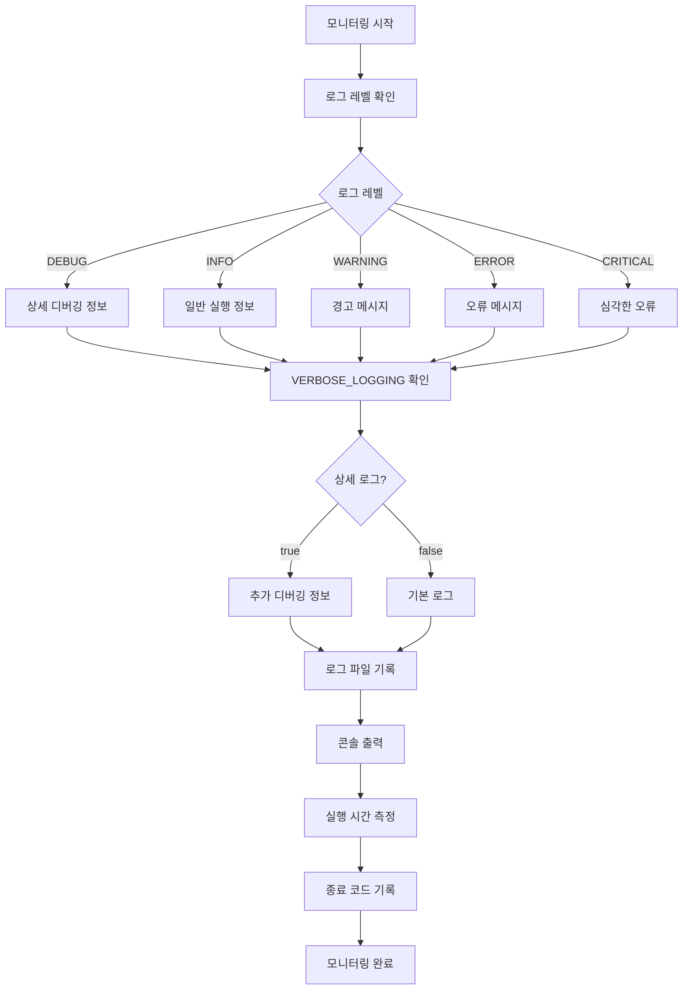

## 🎯 주요 개선사항

### 1. 코드 최적화
- **44% 코드 라인 감소**: ~1,600라인 → ~900라인
- **39% 함수 수 감소**: 38개 → 23개
- **100% 미사용 함수 제거**: 15개 함수 완전 제거
- **100% 중복 함수 제거**: 1개 중복 함수 제거

### 2. 로그 시스템 개선
- **로그 레벨 제어**: DEBUG, INFO, WARNING, ERROR, CRITICAL
- **상세 로그 기능**: VERBOSE_LOGGING 옵션
- **일일 로그 파일**: cron_YYMMDD.log 형식
- **자동 정리 기능**: 오래된 로그 파일 자동 삭제

### 3. TaskMaster AI 통합
- **AI 기반 작업 관리**: PRD 문서에서 자동 작업 생성
- **작업 복잡도 분석**: AI가 작업을 세부 작업으로 분해
- **의존성 관리**: 작업 간 의존성 자동 관리
- **상태 추적**: 실시간 작업 진행 상황 추적

### 4. 성능 최적화
- **페이지네이션 선택적 사용**: 기본값은 빠른 실행
- **재시도 로직**: 연결된 IT 티켓 조회 시 최대 3회 재시도
- **중복 알림 방지**: 변경사항 해시 기반 중복 방지
- **시간 제한**: Slack 알림은 8시~21시에만 전송

이 다이어그램들은 `create_weekly_report.py` 스크립트의 전체적인 프로세스와 각 단계별 동작을 시각적으로 보여줍니다. 주요 특징은 다음과 같습니다:

1. **모듈화된 구조**: 각 기능이 독립적인 함수로 분리되어 있음
2. **에러 처리**: 각 단계에서 예외 상황을 고려한 처리
3. **중복 방지**: 변경사항 해시를 통한 중복 알림 방지
4. **유연한 모드**: 다양한 실행 모드 지원
5. **디버깅 지원**: 특정 티켓의 연결 관계 디버깅 기능
6. **로그 시스템**: 고급 로그 레벨 제어 및 일일 로그 관리
7. **AI 통합**: TaskMaster AI를 통한 작업 관리 자동화
8. **성능 최적화**: 사용하지 않는 함수 제거로 코드 효율성 향상 